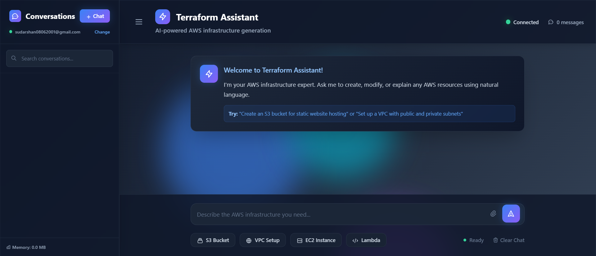

# Terraform MCP Assistant

AI-powered infrastructure automation tool that generates and executes Terraform code using MCP servers and LLMs.



## Overview

Terraform MCP Assistant combines large language models with AWS Labs Terraform MCP Server to intelligently generate and directly execute Terraform configurations.

**How it works:**
1. Describe infrastructure needs in natural language
2. AI (DeepSeek/Claude/GPT-4) generates Terraform code
3. AWS Labs MCP Server validates against AWS best practices
4. Terraform files are created and automatically executed
5. AWS resources are provisioned

## Features

- **AI-Powered Code Generation**: Natural language to Terraform conversion
- **MCP Server Integration**: AWS Labs Terraform MCP Server for real-time resource schemas
- **Automatic Execution**: Creates .tf files and runs terraform apply directly
- **Complex Deployments**: Multi-resource, multi-tier infrastructure support
- **Async Operations**: Non-blocking MCP client for high performance
- **Multiple LLM Support**: DeepSeek, OpenAI, Claude, or any compatible model

## Tech Stack

- Java 11+, Spring Boot 3.x, Spring AI
- LLMs: DeepSeek (default), OpenAI, Anthropic Claude, etc.
- MCP: AWS Labs Terraform MCP Server
- Infrastructure: Terraform, AWS
- Build: Maven
- Version Control: Git

## Quick Start

### Prerequisites
- Java 11+
- Maven 3.6+
- Terraform 1.0+
- AWS credentials configured
- API key for your chosen LLM

### Setup

1. **Clone Repository**
```bash
git clone https://github.com/sudarshanj01/terraform-mcp-assistant.git
cd terraform-mcp-assistant
```

2. **Configure LLM (Choose One)**

**DeepSeek (Default)**
```bash
export DEEPSEEK_API_KEY=your_key
```

**OpenAI**
```bash
export OPENAI_API_KEY=your_key
```

**Anthropic Claude**
```bash
export ANTHROPIC_API_KEY=your_key
```

3. **Configure AWS Credentials**
```bash
export AWS_ACCESS_KEY_ID=your_key
export AWS_SECRET_ACCESS_KEY=your_secret
export AWS_REGION=us-east-1
```

4. **Build & Run**
```bash
./mvnw clean install
./mvnw spring-boot:run
```

Access at: `http://localhost:8080`

## Usage

### Web UI
1. Enter infrastructure request: "Create VPC with EC2 instance and RDS database"
2. Select quick templates or describe custom setup
3. Click generate - Terraform code is created and executed
4. View generated .tf files in `terraform/generated/`

### API
```bash
POST /api/terraform/generate
{
  "request": "Create S3 bucket for static website hosting",
  "region": "us-east-1",
  "auto_apply": true
}
```

## Configuration

Edit `application.properties`:

```properties
# Application
spring.application.name=mcp

# LLM Configuration (choose one)
# DeepSeek
spring.ai.openai.api-key=${DEEPSEEK_API_KEY}
spring.ai.openai.base-url=https://api.deepseek.com
spring.ai.openai.chat.options.model=deepseek-chat

# OR OpenAI
# spring.ai.openai.api-key=${OPENAI_API_KEY}
# spring.ai.openai.chat.options.model=gpt-4

# OR Anthropic Claude
# spring.ai.anthropic.api-key=${ANTHROPIC_API_KEY}

# MCP Configuration
spring.ai.mcp.client.type=ASYNC
spring.ai.mcp.client.request-timeout=120s
spring.ai.mcp.client.toolcallback.enabled=true

# AWS Labs Terraform MCP Server
spring.ai.mcp.client.stdio.connections.terraform-mcp-server.command=uvx
spring.ai.mcp.client.stdio.connections.terraform-mcp-server.args=awslabs.terraform-mcp-server@latest
spring.ai.mcp.client.stdio.connections.terraform-mcp-server.env.FASTMCP_LOG_LEVEL=ERROR
```

## Supported AWS Resources

- **Compute**: EC2, ECS, EKS, Lambda
- **Storage**: S3, EBS, EFS
- **Database**: RDS, DynamoDB, ElastiCache
- **Networking**: VPC, Subnets, Security Groups, NAT Gateway
- **IAM**: Roles, Policies, Users
- **Monitoring**: CloudWatch, SNS, SQS

## Project Structure

```
terraform-mcp-assistant/
├── src/main/java/          # Spring Boot application
├── src/main/resources/     # Configuration files
├── terraform/generated/    # Auto-generated .tf files
├── pom.xml                 # Maven configuration
├── README.md              # This file
└── terraform-assistant-ui.png  # UI screenshot
```

## Testing

```bash
# Run tests
./mvnw test

# Integration tests
./mvnw verify
```

## Build & Package

```bash
# Create executable JAR
./mvnw clean package

# Run JAR
java -jar target/mcp-1.0.0.jar
```

## Contributing

1. Fork repository
2. Create feature branch: `git checkout -b feature/amazing-feature`
3. Commit: `git commit -m 'Add amazing feature'`
4. Push: `git push origin feature/amazing-feature`
5. Open Pull Request

## Future Enhancements

- [ ] Terraform state management UI
- [ ] Cost estimation integration
- [ ] Multi-cloud support (Azure, GCP)
- [ ] GitOps integration
- [ ] Infrastructure drift detection
- [ ] Web UI improvements

## License

MIT License - See LICENSE file

## Author

**Sudarshan Jadhav**
- GitHub: [@sudarshanj01](https://github.com/sudarshanj01)
- Email: sudarshan08062001@gmail.com
- LinkedIn: [sudarshan-jadhav-8a3982199](https://linkedin.com/in/sudarshan-jadhav-8a3982199)

## Acknowledgments

- AWS Labs for Terraform MCP Server
- DeepSeek, OpenAI, Anthropic for LLM APIs
- Spring AI for excellent framework
- Terraform for IaC excellence

---

**Built with Java, Spring Boot, AI, and Cloud** ☁️
